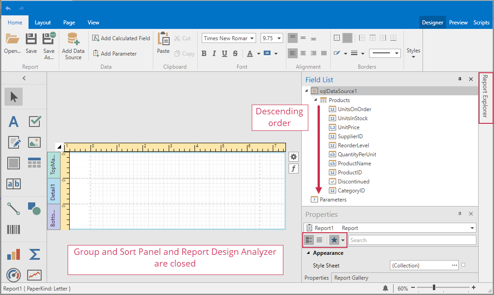

<!-- default badges list -->

<!-- default badges end -->
# Reporting for WPF - How to Customize Report Designer Dock Panels

This example illustrates the use of the following options:

* [ReportDesigner.GroupAndSortPanelOptions](https://docs.devexpress.com/WPF/DevExpress.Xpf.Reports.UserDesigner.ReportDesigner.GroupAndSortPanelOptions) to close the [Group and Sort Panel](https://docs.devexpress.com/XtraReports/114800)
* [ReportDesigner.ReportExplorerOptions](https://docs.devexpress.com/WPF/DevExpress.Xpf.Reports.UserDesigner.ReportDesigner.ReportExplorerOptions) to enable the [Report Explorer](https://docs.devexpress.com/XtraReports/114798)'s [auto-hide mode](https://docs.devexpress.com/WPF/6827)
* [ReportDesigner.FieldListOptions](https://docs.devexpress.com/WPF/DevExpress.Xpf.Reports.UserDesigner.ReportDesigner.FieldListOptions) to change the sort order in the [Field List](https://docs.devexpress.com/XtraReports/114797)
* [ReportDesigner.PropertyGridOptions](https://docs.devexpress.com/WPF/DevExpress.Xpf.Reports.UserDesigner.ReportDesigner.PropertyGridOptions) to disable the [Property Grid](https://docs.devexpress.com/XtraReports/114799)'s tabbed view and display favorite properties

## Files to Review

- [MainWindow.xaml](CS/MainWindow.xaml) (VB: [MainWindow.xaml](VB/MainWindow.xaml))

## Documentation

- [Customize Dock Panels in the Report Designer](https://docs.devexpress.com/XtraReports/116785)

## More Examples

- [WPF Report Designer - How to customize the list of data providers in the Data Source Wizard](https://github.com/DevExpress-Examples/Reporting_wpf-report-designer-how-to-customize-the-list-of-data-providers-in-the-data-source-t456882)
<!-- feedback -->
## Does this example address your development requirements/objectives?

 

(you will be redirected to DevExpress.com to submit your response)
<!-- feedback end -->
